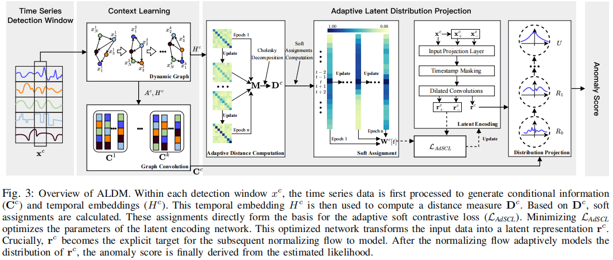
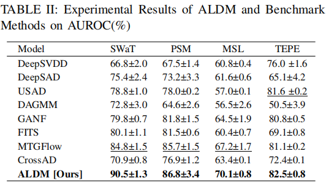
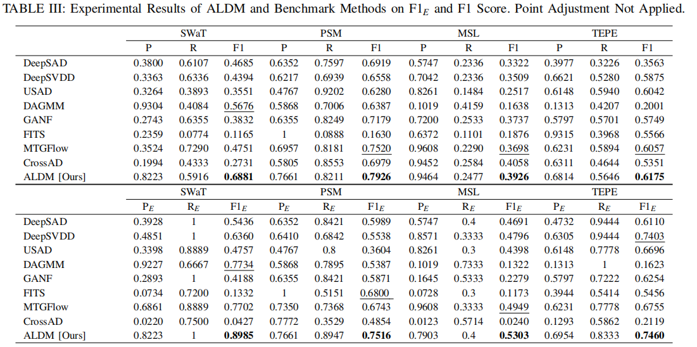

# Adaptive Latent Distribution Modeling for Industrial Time Series Anomaly Detection (T-ASE)

This repository provides a PyTorch implementation of ALDM, which is the unsupervised anomaly detection method. 
This repository is based on [`softclt`](https://github.com/seunghan96/softclt)and[`MTGFLOW`](https://github.com/zqhang/MTGFLOW).

## Framework


## Main results



## Requirements
* matplotlib==3.7.5
* numpy==1.24.3
* pandas==2.0.3
* scikit_learn==0.24.1
* torch==2.1.0


```sh
pip install -r requirements.txt
```

## Data
We test our method for four public datasets, e.g., ```SWaT```, ```TEPE```, ```PSM```,and ```MSL```

[`SWaT`](https://itrust.sutd.edu.sg/itrust-labs_datasets/dataset_info/#swat) 

```sh
mkdir Dataset
cd Dataset
mkdir input
```
Download the dataset in ```Data/input```.
## Train
- train for ALDM
```sh
For example, training for SWaT
```sh
python -u train.py --name SWaT --model ALDM --lr 0.002 --batch_size 512 --num_epochs 100 
```
- train for ```DeepSVDD```, ```DeepSAD```, ```DROCC```, and ```ALOCC```. 
```sh
python train_other_model.py --name SWaT --model DeepSVDD
```
- train for ```MTGFLOW```, ```USAD``` and ```DAGMM```
We report the results by the implementations in the following links: 

[`MTGFLOW`](https://github.com/zqhang/MTGFLOW),[`USAD`](https://github.com/manigalati/usad) and [`DAGMM`](https://github.com/danieltan07/dagmm/)


## Test

For example, testing for SWaT 
```sh
sh runners/run_SWaT_test.sh
```
## BibTex Citation

If you find this paper and repository useful, please cite our paper.

```
@article{liu2026aldm,
  title={Adaptive Latent Distribution Modeling for Industrial Time Series Anomaly Detection},
  author={Liu, Yu and Song, Yifan and Shu, Shaolong and Lin, Feng and Wang, Jun and Guo, Yafeng},
  journal={IEEE Transactions on Automation and Science and Engineering},
  year={2026},
  publisher={IEEE}
}
```


